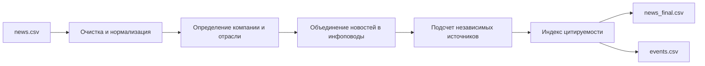
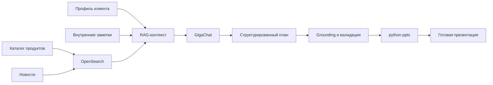
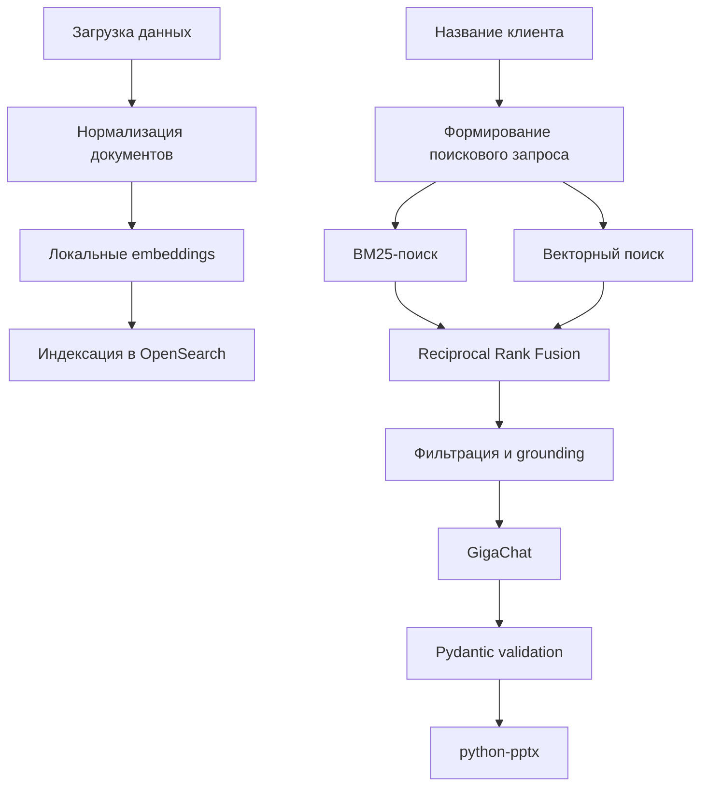

# Анализ цитируемости новостей и RAG-агент для генерации клиентских презентаций

Репозиторий содержит решение трех связанных задач:

1. **Анализ цитируемости и растиражированности новостей**
   Новости объединяются в инфоповоды, для каждого события рассчитывается число независимых источников и индекс цитируемости.

2. **RAG-агент для генерации клиентских презентаций**
   Агент собирает сведения о компании, внутренние заметки, подходящие финансовые продукты и релевантные новости, после чего формирует презентацию в формате `.pptx`.

3. **Система валидации агента**
   Позволяет сравнивать разные версии retrieval-логики, промптов, параметров поиска и генератора презентаций по единому набору метрик.

---

## Содержание

* [Общая архитектура](#общая-архитектура)
* [Задача 1. Анализ цитируемости новостей](#задача-1-анализ-цитируемости-новостей)
* [Задача 2. Агент для генерации презентаций](#задача-2-агент-для-генерации-презентаций)
* [Задача 3. Валидация агента](#задача-3-валидация-агента)
* [Структура репозитория](#структура-репозитория)
* [Установка](#установка)
* [Настройка GigaChat API](#настройка-gigachat-api)
* [Запуск OpenSearch](#запуск-opensearch)
* [Запуск анализа цитируемости](#запуск-анализа-цитируемости)
* [Генерация презентации](#генерация-презентации)
* [Сравнение версий агента](#сравнение-версий-агента)
* [Формат результатов](#формат-результатов)
* [Основные инженерные решения](#основные-инженерные-решения)
* [Ограничения](#ограничения)

---

# Общая архитектура

В репозитории реализованы два основных пайплайна.





Основной стек:

* Python;
* Jupyter Notebook;
* Pandas;
* OpenSearch;
* Docker Compose;
* `sentence-transformers`;
* GigaChat API;
* Pydantic;
* `python-pptx`;
* `json-repair`;
* Tenacity.

---

# Задача 1. Анализ цитируемости новостей

## Постановка задачи

На вход подается набор новостей:

```text
news.csv
```

Основные поля:

| Поле     | Описание            |
| -------- | ------------------- |
| `title`  | заголовок новости   |
| `text`   | полный текст        |
| `source` | источник публикации |

Необходимо:

1. очистить и нормализовать новости;
2. определить компанию, к которой относится публикация;
3. определить отрасль из заданного набора категорий;
4. объединить публикации об одном событии в общий инфоповод;
5. определить число независимых источников события;
6. рассчитать индекс цитируемости;
7. сформировать итоговые таблицы по новостям и событиям.

В этой задаче под цитируемостью понимается не наличие прямой ссылки на исходный материал, а **растиражированность одного инфоповода разными источниками**.

---

## Очистка данных

Перед аналитикой выполняется нормализация:

* удаление повторяющихся пробелов;
* декодирование HTML-последовательностей;
* удаление повторного заголовка из начала текста;
* обработка пустых значений;
* удаление полных дубликатов;
* нормализация регистра;
* очистка технических Telegram-вставок;
* создание единого поля для поиска и кластеризации.

Пример:

```python
def collapse_spaces(value: str) -> str:
    value = html.unescape(str(value))
    value = value.replace("\u200b", " ")
    value = value.replace("\xa0", " ")
    return re.sub(r"\s+", " ", value).strip()
```

---

## Нормализация источников

Большая часть источников в исходном наборе представлена ссылками вида:

```text
https://t.me/s/banksta
https://t.me/s/rbc_news
https://t.me/s/kommersant
```

Использовать только домен `t.me` нельзя: в таком случае все Telegram-каналы превращаются в один источник.

Корректная нормализация:

```text
https://t.me/s/banksta
→ telegram:banksta

https://t.me/s/rbc_news
→ telegram:rbc_news
```

Пример функции:

```python
def normalize_source(source_url: str) -> str:
    source_url = collapse_spaces(source_url)

    match = re.search(
        r"(?:https?://)?t\.me/(?:s/)?([^/?#]+)",
        source_url,
        flags=re.IGNORECASE,
    )

    if match:
        return f"telegram:{match.group(1).lower()}"

    return source_url.lower()
```

Полная исходная ссылка сохраняется отдельно, чтобы пользователь мог перейти к публикации.

---

## Определение компании

Для каждой компании задается набор алиасов:

```python
COMPANY_ALIASES = {
    "РЖД": [
        "РЖД",
        "Российские железные дороги",
        "ОАО Российские железные дороги",
    ],
    "Аэрофлот": [
        "Аэрофлот",
        "Группа Аэрофлот",
        "ПАО Аэрофлот",
    ],
}
```

Поиск выполняется по нормализованным словам и выражениям.

Важно использовать границы слов. Простой поиск подстроки:

```python
"ржд" in text
```

может создавать ложные совпадения внутри других слов.

Используется проверка отдельного алиаса:

```python
def contains_whole_alias(text: str, alias: str) -> bool:
    normalized_text = normalize_for_search(text)
    normalized_alias = normalize_for_search(alias)

    return (
        f" {normalized_alias} "
        in f" {normalized_text} "
    )
```

---

## Определение отрасли

Каждая новость классифицируется в одну из 14 отраслей.

Примеры категорий:

* энергетика;
* транспорт;
* металлургия;
* нефтегазовая отрасль;
* телекоммуникации;
* ритейл;
* финансовый сектор;
* информационные технологии.

Классификация может учитывать:

* название найденной компании;
* ключевые слова;
* описание компании;
* содержание новости;
* результат языковой модели.

Для неизвестных или неоднозначных публикаций сохраняется нейтральная категория.

---

## Объединение публикаций в события

Несколько публикаций могут описывать один и тот же инфоповод разными словами.

Например:

```text
РЖД рассматривает возможность IPO
```

и:

```text
Выход РЖД на биржу может увеличить капитализацию рынка
```

должны относиться к одному `event_id`.

Общий алгоритм:

1. очистка заголовка и текста;
2. получение текстового представления новости;
3. оценка текстового сходства;
4. объединение близких публикаций;
5. назначение общего `event_id`;
6. выбор представительного заголовка события.

Для события сохраняется наиболее информативный заголовок. Если специальное поле представительного заголовка отсутствует, используется безопасная цепочка fallback:

```python
event_title = (
    row.get("event_display_title")
    or row.get("representative_title")
    or row.get("title")
    or f"Событие {event_id}"
)
```

Это предотвращает ошибки вида:

```text
KeyError: 'event_display_title'
```

---

## Метрика цитируемости

Для каждого события считается число уникальных нормализованных источников:

```text
event_sources_count
```

Число цитирований определяется как:

```text
citation_count = max(event_sources_count - 1, 0)
```

Первая публикация считается исходным сообщением, а остальные независимые источники — распространением инфоповода.

Для нормирования используется логарифмический индекс:

```text
citation_index =
100 × ln(1 + citation_count)
    / ln(1 + max_citation_count)
```

или в Python:

```python
citation_index = (
    100
    * np.log1p(citation_count)
    / np.log1p(max_citation_count)
)
```

Индекс находится в диапазоне от 0 до 100.

Логарифмическая шкала используется потому, что распределение цитируемости новостей обычно сильно скошено: несколько событий получают большое число публикаций, а большинство — только одну или две.

---

## Результаты задачи 1

### `news_final.csv`

Финальная таблица по отдельным публикациям:

| Поле                | Описание                                    |
| ------------------- | ------------------------------------------- |
| `news_id`           | идентификатор публикации                    |
| `title`             | исходный заголовок                          |
| `text`              | очищенный текст                             |
| `source`            | исходная ссылка                             |
| `source_normalized` | нормализованный источник                    |
| `company`           | найденная компания                          |
| `industry`          | отрасль                                     |
| `event_id`          | идентификатор инфоповода                    |
| `citation_count`    | количество независимых повторных источников |
| `citation_index`    | индекс цитируемости от 0 до 100             |

### `events.csv`

Агрегированная таблица по инфоповодам:

| Поле                   | Описание                    |
| ---------------------- | --------------------------- |
| `event_id`             | идентификатор события       |
| `representative_title` | представительный заголовок  |
| `articles_count`       | число публикаций            |
| `sources_count`        | число уникальных источников |
| `event_sources`        | список источников           |
| `citation_count`       | число цитирований           |
| `citation_index`       | нормированный индекс        |

---

# Задача 2. Агент для генерации презентаций

## Постановка задачи

Необходимо разработать агента, который по названию клиента автоматически формирует презентацию для подготовки к встрече.

Агент должен учитывать:

* профиль компании;
* основные бизнес-задачи;
* внутренние заметки;
* финансовые риски;
* каталог доступных банковских продуктов;
* новости, непосредственно относящиеся к клиенту.

Результат:

```text
<ClientName>_<timestamp>.pptx
```

---

## Входные данные

### `clients.json`

Содержит профиль клиента:

```json
{
  "name": "РЖД",
  "industry": "Транспорт",
  "description": "Крупная инфраструктурная компания",
  "financial_tasks": [
    "управление стоимостью долга",
    "финансирование инвестиционной программы"
  ]
}
```

### `internal_notes.json`

Содержит внутренний контекст:

```json
{
  "client": "РЖД",
  "text": "Клиент заинтересован в управлении процентным риском"
}
```

### `products.json`

Содержит описание финансовых продуктов:

```json
{
  "name": "IRS",
  "description": "Инструмент управления процентным риском"
}
```

### `news.csv`

```text
title,text,source
```

Новости проходят ту же очистку и нормализацию источников, что и в задаче анализа цитируемости.

---

## Архитектура RAG

RAG-пайплайн разделен на несколько этапов.



---

## Локальные embeddings

Изначально для embeddings предполагалось использовать GigaChat API.

Запрос к endpoint:

```text
/v1/embeddings
```

для бесплатного ключа возвращал:

```text
402 Payment Required
```

Поэтому embeddings были вынесены в локальную модель:

```text
intfloat/multilingual-e5-small
```

Документы кодируются с префиксом:

```text
passage:
```

Запросы — с префиксом:

```text
query:
```

Пример:

```python
class LocalEmbeddingService:
    def __init__(
        self,
        model_name="intfloat/multilingual-e5-small",
        device="cpu",
    ):
        self.model = SentenceTransformer(
            model_name,
            device=device,
        )

        self.dimension = (
            self.model
            .get_sentence_embedding_dimension()
        )

    def embed_documents(self, texts):
        prepared = [
            f"passage: {text}"
            for text in texts
        ]

        return self.model.encode(
            prepared,
            normalize_embeddings=True,
        )

    def embed_query(self, text):
        return self.model.encode(
            f"query: {text}",
            normalize_embeddings=True,
        )
```

---

## OpenSearch

OpenSearch запускается локально через Docker Compose.

Он используется для:

* полнотекстового BM25-поиска;
* хранения векторных представлений;
* kNN-поиска;
* фильтрации по типу документа;
* поиска документов, связанных с конкретным клиентом.

Пример схемы индекса:

```json
{
  "settings": {
    "index": {
      "knn": true
    }
  },
  "mappings": {
    "properties": {
      "title": {
        "type": "text",
        "analyzer": "russian"
      },
      "text": {
        "type": "text",
        "analyzer": "russian"
      },
      "doc_type": {
        "type": "keyword"
      },
      "client_names": {
        "type": "keyword"
      },
      "embedding": {
        "type": "knn_vector",
        "dimension": 384
      }
    }
  }
}
```

---

## Гибридный поиск

Используются два вида поиска:

1. BM25 — хорошо находит точные слова и названия;
2. vector search — находит семантически близкие документы.

Результаты объединяются с помощью Reciprocal Rank Fusion:

```text
RRF score(d) =
Σ 1 / (k + rank(d))
```

Такой подход устойчивее, чем использование только одной поисковой модели.

---

## Отбор новостей

Простого упоминания клиента в полном тексте недостаточно.

Например, статья может быть посвящена другой компании, а РЖД упоминаться только в одном предложении.

Поэтому применяется двухступенчатый отбор:

```text
OpenSearch
→ кандидаты
→ проверка прямого упоминания клиента
→ фильтр чувствительных публикаций
→ итоговый список
```

Для клиентского слайда преимущественно используются новости, в заголовке которых явно присутствует название или алиас компании.

Дополнительно исключаются публикации, содержащие чувствительный или нерелевантный контекст:

```python
SENSITIVE_NEWS_PATTERNS = [
    r"\bфронт\w*",
    r"\bвоенн\w*",
    r"\bоруж\w*",
    r"\bбпла\b",
    r"\bтеррор\w*",
]
```

Это уменьшает вероятность блокировки запроса со стороны GigaChat.

---

## GigaChat

GigaChat используется не для поиска и не для принятия окончательного финансового решения, а для:

* сокращения найденных текстов;
* структурирования материала;
* формирования нейтральных формулировок;
* подготовки содержимого слайдов;
* генерации вопросов к клиенту;
* формирования следующих шагов.

Системный промпт задает роль технического редактора:

```text
Ты — технический редактор внутренних корпоративных презентаций.

Тебе передан уже подготовленный набор фактов,
кандидатов-продуктов и новостей.

Ты не принимаешь финансовых решений.
Не добавляй внешние сведения.
Верни только один JSON-объект.
```

Такой вариант оказался устойчивее, чем запрос прямых финансовых рекомендаций.

---

## Структурированный план

Ответ модели преобразуется в Pydantic-модель:

```python
class PresentationPlan(BaseModel):
    client_name: str
    subtitle: str
    profile_summary: str
    financial_tasks: list[str]
    risks: list[RiskItem]
    products: list[ProductRecommendation]
    news: list[NewsItem]
    meeting_questions: list[str]
    next_steps: list[str]
```

Если модель добавляет Markdown или возвращает почти корректный JSON, используется:

```text
json-repair
```

Дополнительно реализованы:

* поиск первого сбалансированного JSON-объекта;
* повторный запрос на исправление ответа;
* Pydantic-валидация;
* проверка grounding;
* локальный fallback-план.

---

## Grounding

После генерации выполняется проверка:

* продукт существует в retrieved-кандидатах;
* название продукта совпадает с каталогом;
* новость существует в retrieved-контексте;
* источник новости не был придуман;
* модель не добавила внешние факты;
* нежелательные продукты удалены;
* при отсутствии релевантных новостей возвращается пустой список.

Модель не может добавить в презентацию продукт или новость, отсутствующие в RAG-контексте.

---

## Генерация PPTX

Презентация создается с помощью:

```text
python-pptx
```

Стандартная структура:

1. титульный слайд;
2. профиль клиента и задачи;
3. ключевые риски;
4. продуктовые темы;
5. новости;
6. вопросы и следующие шаги.

Для защиты от переполнения текста реализованы:

* ограничение максимальной длины;
* сокращение по границе слова;
* `word_wrap`;
* `TEXT_TO_FIT_SHAPE`;
* динамическая высота карточек;
* отдельные зоны для заголовка и текста новости;
* адаптивный размер шрифта;
* ограничение числа пунктов на слайде.

---

# Задача 3. Валидация агента

## Главный вопрос

Система валидации должна отвечать на вопрос:

> Стало ли качество агента лучше или хуже после изменения промпта, retrieval-логики, параметров поиска, чанкинга или генератора PPTX?

Для этого каждая версия запускается на одном и том же тестовом наборе.

---

## Тестовый набор

Используются клиенты:

```text
РусГидро
Аэрофлот
Норникель
РЖД
Магнит
Лукойл
МТС
ФосАгро
```

Разделение:

```text
dev:
РусГидро, Аэрофлот, РЖД, Магнит, Лукойл, МТС

holdout:
Норникель, ФосАгро
```

Для каждого клиента задаются:

* основные ожидаемые продукты;
* допустимые дополнительные продукты;
* запрещенные или нерелевантные продукты;
* ожидаемые категории рисков;
* релевантные прямые новости.

Тестовый набор сохраняется в:

```text
evaluation/gold_test_set.json
```

---

## Retrieval-метрики

### Product Precision

Доля найденных продуктов, допустимых для клиента:

```text
Product Precision =
релевантные retrieved-продукты
/ все retrieved-продукты
```

### Core Product Recall

Доля обязательных продуктов, найденных системой:

```text
Core Product Recall =
найденные основные продукты
/ все ожидаемые основные продукты
```

### Forbidden Product Clean Rate

Проверяет отсутствие запрещенных продуктов:

```text
1 — запрещенных продуктов нет
0 — найден хотя бы один запрещенный продукт
```

### Mean Reciprocal Rank

Оценивает положение первого релевантного продукта:

```text
MRR = 1 / rank
```

Чем ближе релевантный продукт к первому месту, тем выше метрика.

### News Precision

```text
News Precision =
релевантные retrieved-новости
/ все retrieved-новости
```

### News Recall

```text
News Recall =
найденные релевантные новости
/ все ожидаемые релевантные новости
```

---

## Generation-метрики

Проверяется:

* получен ли валидный `PresentationPlan`;
* сработал ли fallback;
* была ли блокировка GigaChat;
* заполнены ли обязательные разделы;
* принадлежат ли продукты retrieval-результатам;
* принадлежат ли новости retrieval-результатам;
* покрыты ли основные продукты;
* отсутствуют ли запрещенные продукты;
* найдены ли ожидаемые риски;
* соответствует ли текст ограничениям по длине.

---

## PPTX-метрики

Файл повторно открывается через `python-pptx`.

Проверяются:

* валидность презентации;
* ожидаемое число слайдов;
* наличие пустых слайдов;
* выход объектов за границы;
* пересечения текстовых блоков;
* вероятное переполнение текста;
* наличие обязательных заголовков.

Проверка переполнения является эвристической, поскольку `python-pptx` не выполняет полный рендеринг PowerPoint.

Однако она позволяет сравнивать две версии одного шаблона и автоматически находить регрессии верстки.

---

## Общий Quality Score

Метрики объединяются в итоговый балл от 0 до 100.

Пример весов:

| Группа                 | Вес |
| ---------------------- | --: |
| retrieval продуктов    | 30% |
| retrieval новостей     | 12% |
| generation и grounding | 41% |
| качество PPTX          | 17% |

```python
QUALITY_WEIGHTS = {
    "product_retrieval": 0.30,
    "news_retrieval": 0.12,
    "generation": 0.41,
    "pptx": 0.17,
}
```

---

## Сравнение baseline и candidate

Каждая версия описывается объектом конфигурации:

```python
@dataclass
class AgentVersion:
    name: str
    description: str
    product_top_k: int
    news_candidate_k: int
    direct_news_only: bool
    safe_news_only: bool
    prompt_variant: str
    pptx_builder: Callable
```

Пример baseline:

```python
BASELINE_VERSION = AgentVersion(
    name="baseline_v1",
    description="Исходная версия агента",
    product_top_k=5,
    news_candidate_k=10,
    direct_news_only=False,
    safe_news_only=False,
    prompt_variant="financial_v1",
    pptx_builder=create_pptx_layout_v1,
)
```

Пример candidate:

```python
CANDIDATE_VERSION = AgentVersion(
    name="candidate_v2",
    description=(
        "Прямые новости, фильтр чувствительного "
        "контента и нейтральный промпт"
    ),
    product_top_k=6,
    news_candidate_k=20,
    direct_news_only=True,
    safe_news_only=True,
    prompt_variant="neutral_v2",
    pptx_builder=create_pptx_layout_v2,
)
```

---

## Статистическое сравнение

Для каждой пары результатов рассчитывается:

```text
quality_delta =
candidate_score - baseline_score
```

Также выводятся:

* средний результат baseline;
* средний результат candidate;
* средняя разница;
* число улучшений;
* число ухудшений;
* число совпадений;
* список регрессий;
* bootstrap confidence interval.

Интерпретация:

```text
mean_delta > 0
```

Новая версия в среднем лучше.

```text
delta_ci_low > 0
```

Улучшение устойчиво на текущем тестовом наборе.

```text
mean_delta > 0, но есть losses
```

Среднее качество выросло, но появились регрессии на отдельных клиентах.

---

## Кэширование прогонов

Каждый запуск сохраняется в отдельной папке:

```text
evaluation/runs/<version>/<client>/
```

Сохраняются:

```text
context.json
plan.json
raw_response.txt
metrics.json
<Client>.pptx
```

Это позволяет:

* не расходовать повторно токены GigaChat;
* воспроизводить результаты;
* анализировать ошибку на конкретном этапе;
* сравнивать retrieval и generation отдельно;
* хранить историю экспериментов.

---

## Ручная оценка

Автоматические метрики дополняются ручной проверкой.

Для каждой презентации эксперт оценивает по шкале от 1 до 5:

| Критерий             | Описание                       |
| -------------------- | ------------------------------ |
| `factuality`         | соответствие исходным данным   |
| `client_specificity` | специфичность для клиента      |
| `product_fit`        | обоснованность продуктовых тем |
| `news_relevance`     | релевантность новостей         |
| `readability`        | читаемость и качество верстки  |

Шаблон сохраняется в:

```text
evaluation/human_review_template.csv
```

---

# Структура репозитория

Рекомендуемая структура:

```text
.
├── README.md
├── requirements.txt
├── docker-compose.yml
├── .env.example
├── .gitignore
│
├── notebooks/
│   ├── 01_news_citation_analysis.ipynb
│   ├── 02_client_presentation_agent.ipynb
│   └── 03_agent_validation.ipynb
│
├── src/
│   ├── citation/
│   │   ├── preprocessing.py
│   │   ├── source_normalization.py
│   │   ├── event_clustering.py
│   │   └── metrics.py
│   │
│   ├── agent/
│   │   ├── embeddings.py
│   │   ├── opensearch_store.py
│   │   ├── retrieval.py
│   │   ├── gigachat_service.py
│   │   ├── grounding.py
│   │   └── pptx_builder.py
│   │
│   └── validation/
│       ├── gold_dataset.py
│       ├── retrieval_metrics.py
│       ├── generation_metrics.py
│       ├── pptx_metrics.py
│       └── compare_versions.py
│
├── data/
│   ├── news.csv
│   ├── clients.json
│   ├── products.json
│   └── internal_notes.json
│
├── outputs/
│   ├── news_final.csv
│   ├── events.csv
│   └── presentations/
│
├── evaluation/
│   ├── gold_test_set.json
│   ├── human_review_template.csv
│   └── runs/
│
└── examples/
    ├── РЖД_example.pptx
    └── РусГидро_example.pptx
```

В учебной версии код агента и валидации также может находиться в одном Notebook.

---

# Установка

## 1. Клонирование репозитория

```bash
git clone <repository-url>
cd <repository-name>
```

## 2. Создание виртуального окружения

Windows:

```powershell
python -m venv .venv
.venv\Scripts\activate
```

Linux/macOS:

```bash
python3 -m venv .venv
source .venv/bin/activate
```

## 3. Установка зависимостей

```bash
pip install -r requirements.txt
```

Пример `requirements.txt`:

```text
pandas
numpy
jupyter
python-dotenv
opensearch-py
sentence-transformers
gigachat
python-pptx
pydantic
tenacity
json-repair
requests
```

---

# Настройка GigaChat API

Создайте файл:

```text
.env
```

на основе:

```text
.env.example
```

Пример:

```env
GIGACHAT_CREDENTIALS=your_authorization_key
GIGACHAT_SCOPE=GIGACHAT_API_PERS
GIGACHAT_BASE_URL=https://api.giga.chat/v1
GIGACHAT_CHAT_MODEL=GigaChat-2
GIGACHAT_VERIFY_SSL=false

OPENSEARCH_HOST=localhost
OPENSEARCH_PORT=9200
OPENSEARCH_INDEX=client-presentation-rag
```

В `GIGACHAT_CREDENTIALS` передается Authorization Key без префиксов:

```text
Basic
Bearer
```

Файл `.env` не должен попадать в Git.

Пример `.gitignore`:

```gitignore
.env
.venv/
__pycache__/
.ipynb_checkpoints/
outputs/
evaluation/runs/
```

---

# Запуск OpenSearch

Для запуска требуется установленный Docker Desktop.

```powershell
docker compose up -d
```

Проверка:

```powershell
docker compose ps
```

OpenSearch должен быть доступен по адресу:

```text
http://localhost:9200
```

Проверка:

```powershell
curl.exe http://localhost:9200
```

Остановка:

```powershell
docker compose stop
```

Повторный запуск:

```powershell
docker compose start
```

Удаление контейнера с сохранением данных:

```powershell
docker compose down
```

Удаление контейнера вместе с индексом:

```powershell
docker compose down -v
```

---

# Запуск анализа цитируемости

Откройте:

```text
notebooks/01_news_citation_analysis.ipynb
```

После выполнения всех ячеек будут созданы:

```text
outputs/news_final.csv
outputs/events.csv
```

Пример просмотра наиболее цитируемых событий:

```python
events_df.sort_values(
    "citation_index",
    ascending=False,
).head(20)
```

---

# Генерация презентации

Откройте:

```text
notebooks/02_client_presentation_agent.ipynb
```

При первом запуске:

```python
pptx_path, plan = generate_client_presentation(
    "РЖД",
    rebuild_index=True,
)
```

При повторном запуске индекс пересоздавать не нужно:

```python
pptx_path, plan = generate_client_presentation(
    "РЖД",
    rebuild_index=False,
)
```

Результат будет сохранен в:

```text
outputs/presentations/
```

---

# Сравнение версий агента

Быстрая проверка retrieval без вызова GigaChat:

```python
baseline_retrieval = evaluate_retrieval_only(
    BASELINE_VERSION
)

candidate_retrieval = evaluate_retrieval_only(
    CANDIDATE_VERSION
)
```

Полный прогон:

```python
baseline_results = evaluate_agent_version(
    BASELINE_VERSION,
    rebuild_index=False,
    reuse_cache=False,
)

candidate_results = evaluate_agent_version(
    CANDIDATE_VERSION,
    rebuild_index=False,
    reuse_cache=False,
)
```

Сравнение:

```python
comparison = compare_agent_versions(
    baseline_df=baseline_results,
    candidate_df=candidate_results,
    baseline_name=BASELINE_VERSION.name,
    candidate_name=CANDIDATE_VERSION.name,
)
```

Итоговая таблица:

```python
display(comparison["summary"])
```

Результаты по клиентам:

```python
display(
    comparison["paired_cases"].sort_values(
        "quality_delta",
        ascending=False,
    )
)
```

---

# Формат результатов

После выполнения всех задач репозиторий содержит:

```text
news_final.csv
events.csv
<Client>.pptx
gold_test_set.json
summary.csv
paired_cases.csv
metric_deltas.csv
human_review_template.csv
```

Каждый артефакт можно связать с конкретным этапом пайплайна.

---

# Основные инженерные решения

В ходе разработки были устранены следующие проблемы.

## Все Telegram-источники превращались в `t.me`

Причина: использовался только домен ссылки.

Решение: извлекать идентификатор канала после `/s/`.

```text
https://t.me/s/banksta
→ telegram:banksta
```

## Неинформативные заголовки событий

Причина: представительный заголовок отсутствовал или содержал техническое значение.

Решение: выбирать первый содержательный заголовок события и использовать цепочку fallback.

## `KeyError: event_display_title`

Причина: поле создавалось не во всех ветках пайплайна.

Решение: использовать безопасный `.get()` и резервные поля.

## `401 Authorization error`

Причина: в SDK передавался неверный тип ключа или старое значение оставалось в окружении Jupyter.

Решение:

```python
load_dotenv(
    PROJECT_DIR / ".env",
    override=True,
)
```

и использование Authorization Key без `Basic` и `Bearer`.

## `402 Payment Required` для embeddings

Причина: GigaChat embeddings не входили в используемый бесплатный тариф.

Решение: локальная multilingual-модель для embeddings, GigaChat — только для генерации.

## Блокировка ответа GigaChat

Причина: в промпт попадали чувствительные новости и формулировка прямой финансовой рекомендации.

Решение:

* фильтрация нерелевантных и чувствительных новостей;
* нейтральная роль технического редактора;
* продукты рассматриваются как темы для обсуждения;
* fallback без новостного контекста.

## Невалидный JSON

Решение:

* строгий пример структуры;
* поиск JSON внутри ответа;
* `json-repair`;
* повторный запрос;
* Pydantic-валидация;
* локальный fallback.

## Перекрытия текста в PPTX

Решение:

* динамическая высота карточек;
* ограничение длины;
* адаптивный шрифт;
* отдельные области заголовка и основного текста;
* автоматическая проверка пересечений в системе валидации.

---

# Ограничения

1. В исходном `news.csv` может отсутствовать дата публикации. В таком случае нельзя достоверно определить, какая новость является самой свежей.

2. Автоматическое определение инфоповодов зависит от качества текстового сходства и выбранного порога кластеризации.

3. Индекс цитируемости измеряет число независимых источников, но не учитывает аудиторию, репутацию или охват каждого источника.

4. GigaChat может ограничивать обработку отдельных чувствительных тем.

5. Автоматическая проверка PPTX не заменяет визуальную проверку человеком.

6. Тестовый набор клиентов ограничен, поэтому результаты сравнения следует интерпретировать вместе с bootstrap-интервалом и ручной оценкой.

7. Финансовые продукты в презентации являются предварительными темами для обсуждения, а не готовой инвестиционной рекомендацией.

---

# Возможные направления развития

* добавление даты и времени публикации;
* использование временного окна при объединении новостей;
* выделение первоисточника события;
* взвешивание источников по надежности;
* оценка охвата публикаций;
* автоматическое определение тональности;
* LLM-as-a-judge как дополнительная метрика;
* визуальный regression testing с рендерингом слайдов;
* хранение истории экспериментов в MLflow;
* web-интерфейс для выбора клиента и скачивания презентации;
* поддержка дополнительных шаблонов `.pptx`.

---

# Итог

В репозитории реализован полный воспроизводимый pipeline:

```text
новости
→ очистка
→ нормализация источников
→ объединение в инфоповоды
→ расчет цитируемости
→ RAG-поиск
→ генерация клиентского материала
→ grounding
→ PPTX
→ автоматическая и ручная валидация
→ сравнение версий
```

Решение позволяет не только получить результат, но и проверить, стало ли качество системы лучше после изменения retrieval, промпта, фильтрации, структуры данных или верстки презентаций.
